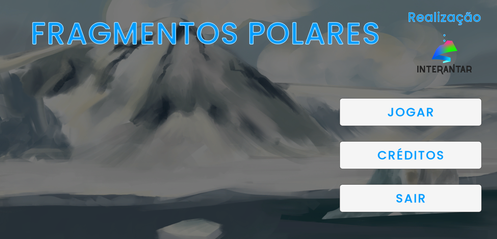
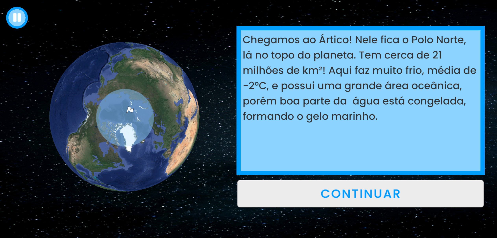
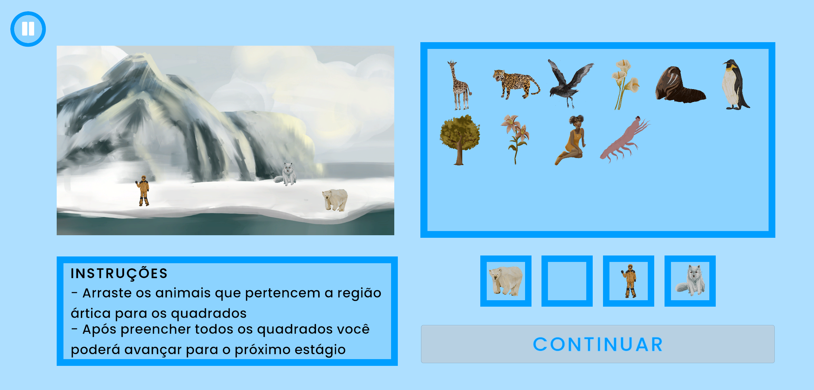
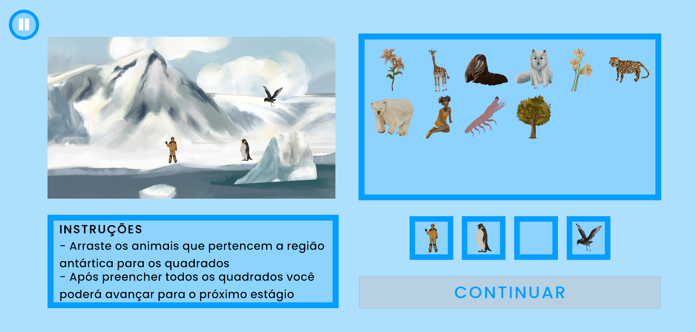

# **Fragmentos Polares**

**Fragmentos Polares** is an **educational game** designed for **children in the early years of education**. The game introduces **basic concepts about the Arctic and Antarctic regions** in a fun and interactive way, combining an **engaging narrative** with **point-and-click mechanics** to keep young players interested.

## **Demo**
**Download it on** [Google Play Store](https://play.google.com/store/apps/details?id=com.interantar.fragmentospolares)

> Some screenshots of the game

    
    

    
    

## **Table of Contents**
- [My Contribuition](#my-contribuition)
- [Skills Demonstrated](#skills-demonstrated)
- [Takeaways](#takeaways)
- [Usage](#usage)
- [License](#license)

## **My Contribuition**
I was the **main contributor** to the project, leading **development and scripting** in **Unity / C#**.  
This included:

- Designing and implementing **core game mechanics and interactions**
- Building **UI screens, HUDs, and puzzle logic**
- Integrating **game assets** (sprites, sounds) and managing **game flow**
- **Deploying the game to Google Play**, handling **Android build configuration** and **app metadata**

## **Skills Demonstrated**

- **Game Development:** Unity, scene management, input handling  
- **C# Programming:** Scripting, object-oriented design  
- **UI/UX:** Menu and interaction design for **children**  
- **Publishing:** Android build and deployment pipeline  
- **Version Control:** Git usage and project organization  

## **Takeaways**

- Learned how to **structure a Unity project** with **reusable game systems and prefabs**
- Improved my understanding of **C# design patterns**
- Gained experience **deploying to mobile platforms**
- Developed a stronger understanding of **anchors** and their use in **responsive UI design**
